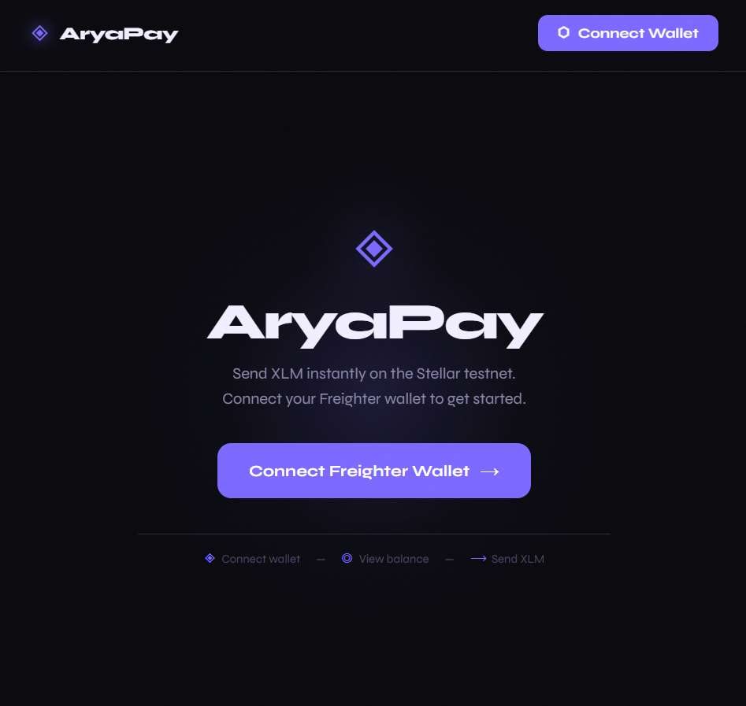
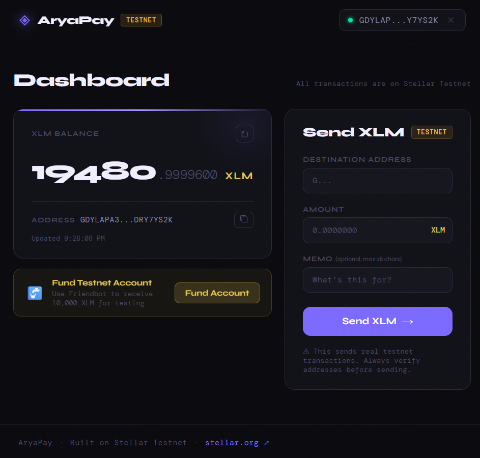
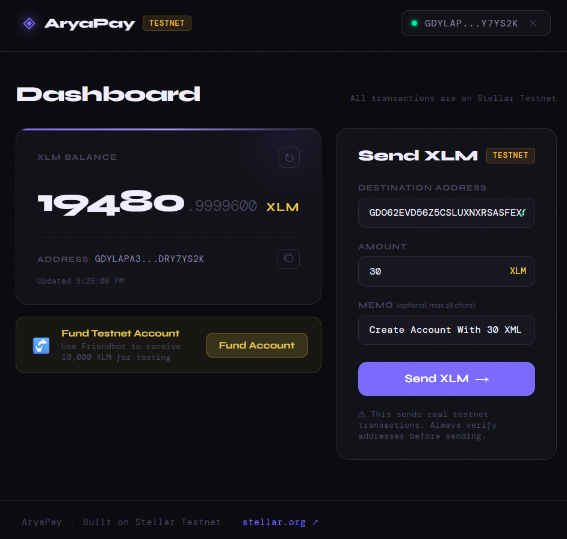
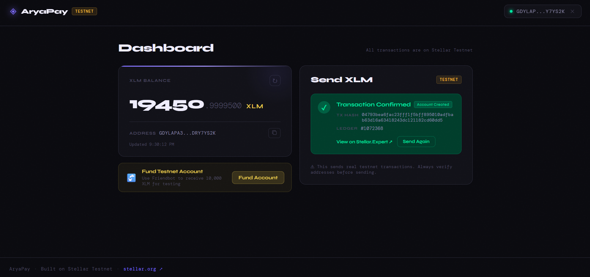

# AryaPay — Simple XLM Payment dApp

> 🚀 **[Live Demo](https://arya-send.vercel.app)**

A minimal, production-grade payment dApp built on the **Stellar Testnet** that lets you connect a Freighter wallet, view your XLM balance, and send XLM to any Stellar address.

Built for the **Level 1 – White Belt** Stellar Developer track.

---

## Features

- **Wallet Connection** — Connect/disconnect Freighter wallet
- **Balance Display** — Live XLM balance with one-click refresh
- **Send XLM** — Payment form with destination address, amount, and optional memo
- **Friendbot Funding** — Fund your testnet account with one click
- **Transaction Feedback** — Success state with TX hash + Stellar.Expert link, or detailed error messages
- **New Account Support** — Automatically uses `createAccount` operation when sending to unfunded addresses

---

## Screenshots

### Wallet Connection Screen


*Landing page prompting user to connect Freighter wallet*

### Wallet Connected with Balance Display


*Dashboard showing connected wallet address and current XLM balance*

### Send Transaction Form


*Payment form with destination address, amount, and optional memo fields*

### Transaction Success


*Success state displaying transaction hash and link to Stellar.Expert*

---

## Tech Stack

| Tool | Purpose |
| ------ | --------- |
| [React 19](https://react.dev) + [Vite 7](https://vitejs.dev) | UI framework + build tool |
| [@stellar/stellar-sdk v14.5.0](https://github.com/stellar/js-stellar-sdk) | Transaction building + Horizon API |
| [@stellar/freighter-api v6.0.1](https://docs.freighter.app) | Wallet connection + signing |
| CSS Modules | Scoped component styles |

---

## Prerequisites

1. **Node.js** v18+ and **Yarn**
2. **Freighter Wallet** browser extension → [freighter.app](https://www.freighter.app)
3. Freighter configured to use **Testnet**

---

## Setup Instructions

### 1. Clone the repository

```bash
git clone https://github.com/iammrjude/arya-pay.git
cd arya-pay
```

### 2. Install dependencies

```bash
yarn install
```

### 3. Start the development server

```bash
yarn dev
```

Open [http://localhost:5173](http://localhost:5173) in your browser.

### 4. Configure Freighter for Testnet

1. Open Freighter extension
2. Click the network selector (top right)
3. Switch to **Testnet**

### 5. Fund your testnet wallet

Click **"Fund Account"** in the app, or visit:

```text
https://friendbot.stellar.org?addr=YOUR_ADDRESS
```

---

## Build for Production

```bash
yarn build
yarn preview
```

---

## How It Works

### Wallet Connection

The app uses `@stellar/freighter-api` to detect, connect, and read the wallet address. On page load it checks `isConnected()` and `isAllowed()` to restore session state automatically.

### Balance Fetching

Calls `https://horizon-testnet.stellar.org` via `@stellar/stellar-sdk` to load account data and extract the `native` (XLM) balance.

### Sending XLM

1. Validates the destination address and amount client-side
2. Checks if destination account exists on-chain
3. If yes → uses `Operation.payment()` with `Asset.native()`
4. If no → uses `Operation.createAccount()` (minimum 1 XLM)
5. Signs the XDR via Freighter's `signTransaction()`
6. Submits to Horizon testnet and displays the resulting TX hash

### Error Handling

Horizon result codes are mapped to human-readable messages (insufficient balance, bad sequence, etc.).

---

## Project Structure

```plaintext
arya-pay/
├── public/
├── screenshots/
├── src/
│   ├── components/
│   │   ├── Header.jsx          # Nav bar with connect/disconnect
│   │   ├── ConnectPrompt.jsx   # Landing screen when disconnected
│   │   ├── BalanceCard.jsx     # XLM balance display
│   │   ├── SendPayment.jsx     # Payment form + TX feedback
│   │   └── FundAccount.jsx     # Friendbot helper
│   ├── hooks/
│   │   └── useFreighter.js     # Freighter wallet state hook
│   ├── utils/
│   │   └── stellar.js          # Horizon calls, TX builder, helpers
│   ├── App.jsx
│   ├── App.module.css
│   ├── main.jsx
│   └── index.css
├── .gitignore
├── index.html
├── package.json
├── README.md
├── vite.config.js
└── yarn.lock
```

---
